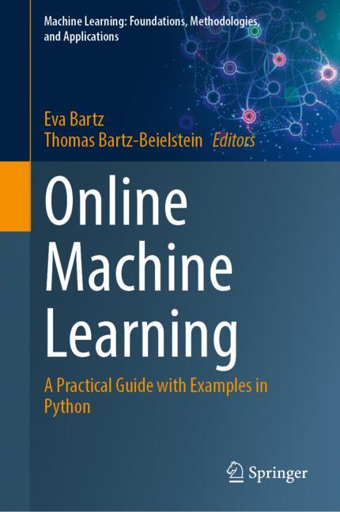

# Online Machine Learning
 

The notebooks in this repository are part of the supplementary material of the books "Online Machine Learning - Eine praxisorientierte Einführung" (https://link.springer.com/book/9783658425043) and "Online Machine Learning - A Practical Guide with Examples in Python" (https://link.springer.com/book/9789819970063).
The contents are open source and published under the "BSD 3-Clause License".
This software is provided "as is" without warranty of any kind, either express or implied, including but not limited to implied warranties of merchantability and fitness for a particular purpose. The author or authors assume no liability for any damages or liability, whether in contract, tort, or otherwise, arising out of or in connection with the software or the use or other dealings with the software.

Die Notebooks in diesem Repository gehören zum Zusatzmaterial der Bücher "Online Machine Learning - Eine praxisorientierte Einführung" (https://link.springer.com/book/9783658425043) und "Online Machine Learning - A Practical Guide with Examples in Python" (https://link.springer.com/book/9789819970063).
Die Inhalte sind Open Source und werden unter der "BSD 3-Clause License" veröffentlicht.
Die vorliegende Software wird ohne Mängelgewähr zur Verfügung gestellt, weder ausdrücklich noch stillschweigend, einschließlich, jedoch nicht beschränkt auf stillschweigende Gewährleistungen der Marktgängigkeit und Eignung für einen bestimmten Zweck. Der Autor oder die Autoren übernehmen keine Haftung für Schäden oder Haftungsansprüche, sei es aufgrund von Verträgen, unerlaubten Handlungen oder anderweitig, die sich aus oder in Verbindung mit der Software oder der Verwendung oder anderen Umgang mit der Software ergeben.
